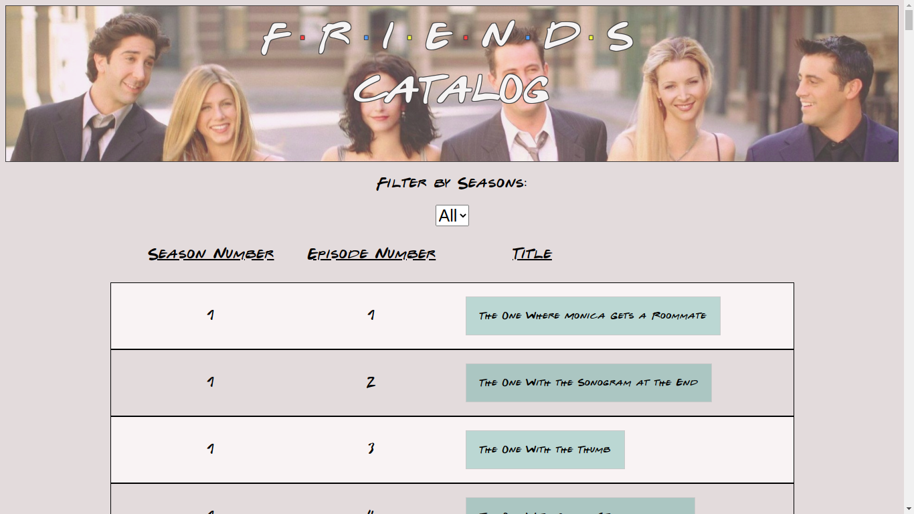

 

# Friends Catalog

First of all, you can find this project's requirements [here](https://www.notion.so/Catalogue-of-Statistics-72446e7fa33c403a9b6a0bc1de5c6cf5).

[Video Presentation](https://www.loom.com/share/349843f0f3c9446db0a949247476a512)

In this project I:

- Used JSX syntax correctly;
- Passed info to components using props with validation;
- Used React components lifecycle methods;
- Used DOM events listeners in components;
- Used lifting to pass state from children to parent components;
- Used client side routes;
- Designed a components structure for a website;
- Tested React code;
- Used Redux store to keep state;
- Explained data flow in Redux;
- Connected Redux to React app (includes map state and dispatch to props);
- Explained when Redux is useful in your SPA and what value it provides you;
- Explained React and virtual DOM concepts;
- Showed ability to translate business requirements into software solutions;
- Showed ability to multitask and effectively manage time and prioritization;
- Showed strong English written communication;
- Showed strong English verbal communication;
- Deployed app to Netlify;
- Used linters (code standards);
- Maintained a professional Github repo.

# What it does?

- When the App is executed, you will be able to:

  - Get a list of all  episodes from the Friends TV Show;
  - Filter episodes by season;
  - See the details from the Friends' episode, like air date, duration, etc. 

## Built with

- React
- Redux
- Jest
- HTML
- SCSS

## Live Demo

[Click here to see it on Netlify!](https://friends-catalog.netlify.app/)

## Getting Started

- Clone the repository on your local machine;
- Cd into the folder;
- Run `npm start`;
- Open your browser and type `localhost:8080`;
- To run tests, type `npm test`.

## Installations

- Install VSCode or any code editor you like;
- Install npm by running `npm install`.

## Author

Murilo Roque Paiva da Silva

Github: [@MuriloRoque](https://github.com/MuriloRoque)

Twitter: [@MuriloRoquePai1](https://twitter.com/MuriloRoquePai1)

Linkedin: [MuriloRoque](https://www.linkedin.com/in/murilo-roque-b1268741/)

## 🤝 Contributing

Contributions, issues and feature requests are welcome! Start by:

- Forking the project
- Cloning the project to your local machine
- `cd` into the project directory
- Run `git checkout -b your-branch-name`
- Make your contributions
- Push your branch up to your forked repository
- Open a Pull Request with a detailed description to the development branch of the original project for a review

## Show your support

Give a ⭐️ if you like this project!
